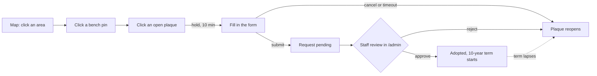

# Adopt a Bench, Riverbend Park

One place to see which of a park's 500+ benches are adopted, by whom and until
when, and to adopt one yourself. Riverbend Park is fictional; the brief
simulates the service for a park whose benches have all been mapped, so every
bench has a position and shows up as a pin.

**Live:** https://css-bench-adoption-program-1.vercel.app · staff queue at `/admin`

## What it does

- **The map is the first screen.** All 532 benches are pins: blue open,
  half-blue one of two plaques open, grey adopted, dashed a spot for a new
  bench. Click an area to zoom in, hover a pin for the donor, click it for
  status, donor and term in the side panel. Search jumps to a bench id or area.
- **Bench page.** A photograph of the bench with its plaques drawn on the
  rail. Each plaque shows the donor and dates, or the adoption form if open.
  Your text appears on the plaque as you type.
- **Adopt in two clicks.** "Adopt this plaque" opens the bench page with the
  form open and the plaque held for you for 10 minutes. The form is VCPA's:
  plaque text (7 lines, 300 characters), name, email, the 6–8 week
  acknowledgement; honoree and notes optional. $3,500 for an existing bench,
  $5,500 for a new one, ten-year term, no payment online.
- **New benches in fixed spots.** The Great Lawn has 12 pre-approved spots,
  shown as dashed pins.
- **Staff queue.** A submission is a *request*. It appears in `/admin`, where
  staff approve it (the ten-year term starts then), reject it (the plaque
  reopens) or mark a new bench as installed. Email goes out on each step
  when SMTP is configured.

## How an adoption flows



Every box on the right is one row in `adoptions` changing status:

```
held ──submit──▶ pending ──approve──▶ active ──10 years──▶ (reads as open)
 │                  │
 └─cancel/timeout   └─reject──▶ cancelled
```

While a row is `held`, `pending` or `active`, nobody else can take that
plaque. That rule lives in the database, not in the app (see below).

## How it is built

Next.js 16 (App Router, server components and server actions), Supabase
Postgres, MapLibre GL on a schematic basemap (no tiles), Tailwind. Deployed
on Vercel.

```
supabase/schema.sql         tables, the partial unique index, views, hold_plaque() / adopt_bench() / review_adoption()
supabase/seed.sql           GENERATED: 9 areas, 520 benches + 12 spots, no adoptions
src/lib/park.ts             the park layout; the map, the seed and the photos all read it
scripts/generate-seed.mts   places benches along each area's paths → supabase/seed.sql
scripts/race-test.mts       8 concurrent adoptions of one plaque → exactly 1 wins
src/app/                    /  ·  /areas/[id]  ·  /benches/[id]  ·  /admin  ·  /about
src/app/actions.ts          holdPlaque, releaseHold, adoptBench (the only public writes)
src/app/admin/actions.ts    reviewAdoption, markInstalled
DECISIONS.md                each design decision, with the alternative considered
```

### The data model

- `benches` is the physical inventory: id, area, style, 4 or 8 ft, installed
  flag, position. A spot for a new bench is a bench with `installed = false`.
- `adoptions` is an append-only log keyed by `(bench_id, side)`. An 8 ft bench
  has two sides, so the side is the unit of adoption.
- Nothing derived is stored. The `bench_sides` view computes `expires_at`
  and whether a side is open from `adopted_at + term_years`.
- One partial unique index is the whole concurrency story:

```sql
create unique index one_live_adoption_per_side
  on adoptions (bench_id, side) where status in ('held', 'pending', 'active');
```

The second person to grab a plaque gets a `23505` from Postgres, which the
app shows as "someone is adopting this plaque".

## Running it

```bash
npm install
cp .env.example .env.local     # SUPABASE_URL, SUPABASE_SERVICE_ROLE_KEY, ADMIN_KEY; SMTP_* optional
# Supabase SQL editor: run supabase/schema.sql, then supabase/seed.sql (both re-runnable)
npm run dev
npm run generate-seed          # only after changing the park layout in src/lib/park.ts
```

Prove the concurrency guarantee against your database:

```bash
npm run race-test
# Firing 8 concurrent adoptions at RB-0001 side A…
# winners: 1, rejected with 23505: 7, other errors: 0
# PASS
```

## Assumptions, in short

Each one is expanded in [DECISIONS.md](DECISIONS.md).

1. The park is fictional and every bench has a known position.
2. A bench *side* is adopted, not a bench. 8 ft benches have two.
3. Adoptions are rows, never flags on the bench, so history is kept.
4. The database refuses double booking, with a partial unique index.
5. A plaque is held when its form opens, for 10 minutes, per browser.
6. Submitting creates a request. Staff approve it; the term starts then.
7. Nothing derived is stored, and expiry is lazy. No cron.
8. New benches only go in pre-approved spots.
9. The inventory is generated from one layout file, reproducibly.
10. No accounts, no online payment. Staff confirm payment at review.
